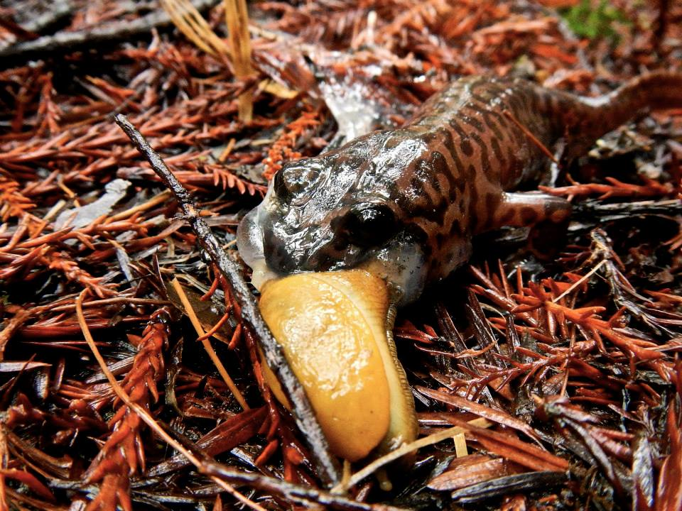

```{r setup, include=FALSE}
knitr::opts_chunk$set(echo = FALSE,
                      message = FALSE,
                      warning = FALSE)
```

```{r}
### Attach packages

library(tidyverse)
library(here)
library(janitor)
library(tidyr)
library(ggridges)
library(directlabels)
library(effsize)
library(kableExtra)
library(ggbeeswarm)
library(car)

```

```{r}
### Read in data and make it tidy

salamanders <- read_csv("mack_creek_vertebrates.csv") %>% 
  clean_names() %>% 
  filter(species == "DITE")

# Data for Results A
salamanders_count <- salamanders %>% 
  count(section, year)%>% 
  mutate(section = replace(section, section == "CC", "Clear Cut")) %>%
  mutate(section = replace(section, section == "OG", "Old Growth"))%>%
 rename(Section = section)


# Data for Results B & C
salamanders_channels <- salamanders %>% 
  filter(year == "2017") %>% 
  filter(unittype != "IP") %>% 
  count(section, unittype) %>% 
  mutate(section = replace(section, section == "CC", "Clear Cut")) %>%
  mutate(section = replace(section, section == "OG", "Old Growth")) %>%
  mutate(unittype = replace(unittype, unittype == "C", "Cascade")) %>%
  mutate(unittype = replace(unittype, unittype == "P", "Pool")) %>%
  mutate(unittype = replace(unittype, unittype == "SC", "Side-Channel"))

# Data for Results D
s_weight_section <- salamanders %>% 
  filter(year == "2017") %>% 
  select(section, weight)

# Data for Results E

s_weight_type <- salamanders %>% 
  filter(year == "2017") %>% 
  filter(unittype != "IP") %>% 
  select(unittype, weight)

```

# Introduction


Salamander and trout populations in the H.J. Andrews Experimental Forest have been monitored for over 20 years in an effort to record long-term population trends related to land use. Pacific giant salamanders (genus *Dicamptodon*) are endemic to the Pacific Northwest and include four distinct species, three of which were differentiated from each other in 1989. Coastal giant salamanders (*Dicamptodon tenebrosus*) were monitored at Mack Creek in Andrews Experimental Forest. This analysis examines abundance and weights of salamanders for different sections (clear cut and old growth forests) and types of habitat (pools, cascades, and side-channels). 
.......More!





# Data and Methods

Researcher Stanley V Gregory has collected data from 1993 - 2017 on the abundance, length, weight and habitat dimensions of Pacific Giant Salamanders (*Dicamptodon tenebrosus*) at two sites; one of the sites was a section that was clearcut in 1963 and the other was a 500 year old coniferous forest located further upstream. The effects of section type (clear cut or old growth) on the abundance of Pacific Giant Salamander was tested using a Chi-square test.  The weights of Pacific Giant Salamanders found in each site were compared using two-sided, two sample t-tests witha 95% confidence interval and Cohen's d. All analyses and figures were prepared using R software version 3.6.1. 

# Results 

### 1. Annual salamander abundance in clear cut and old growth forest sections

Salamander numbers in clear cut and old growth forests were recorded each year at Mack Creek between 1993 and 2017 (Figure 1). In both sections of forest, salamander abundance increased from 1993 to 2017. Abundance of salamanders in the clear cut section increased from 126 in 1993 to 368 by 2017 (192% increase). The abundance in old grwoth increased from 129 to 328 in the time period (154% increase). The two sections generally follow the same trends, with similar dips and peaks. Until 2014, most years had higher salamander abundance in old growth forest sections than in clear cut sections.   

```{r}
### Results A

## Results A Data Exploration

# ggplot(salamanders_count, aes(x = year, y = n)) +
#   geom_bar(stat = "identity")+
#   facet_wrap(~Section)

# ggplot(data = salamanders_count, aes(sample = n))+
#   geom_qq(aes(color = section),
#           alpha = 0.5,
#           show.legend = FALSE)+
#   facet_wrap(~section)

# ggplot(data = salamanders_count, aes(y = Section, x = year))+
#   geom_density_ridges(aes(color = Section, 
#                           fill = Section),
#                       alpha = 0.5)

color_group <-c("chocolate2", "darkgreen")

ggplot(data = salamanders_count, aes(y = n, x = year))+
  geom_line(aes(color = Section),
            alpha = 0.5,
            size = 1.7) +
  theme_minimal() +
  scale_x_continuous(breaks = c(1990, 1995, 2000, 2005, 2010, 2015)) +
  scale_y_continuous(breaks = c(100, 200, 300, 400)) +
  ggtitle("COASTAL GIANT SALAMANDER ABUNDANCE (1993 - 2017)",
          subtitle = "Annual salamander abundance in clear cut and old growth forest sections") +
  labs(x = "Year",
       y = "Salamander count",
       color = "Section") +
   theme(
    legend.position = c(0.25, .88),
    legend.justification = c("right", "top"),
    legend.box.just = "right",
    legend.margin = margin(6, 6, 6, 6),
    legend.background = element_rect("white")) +
   scale_color_manual(values = color_group)
  

```


***Figure 1.*** *Annual California giant salamander abundance (counts) in sections of clear cut forest (orange) and sections of old growth forest (green).Total salamander counts in 2012: clear cut(n) = 126, old growth(n) = 129. Total salamander counts in 2017: clear cut(n) = 368, old growth(n) = 328* 


### 2. Abundance of salamander in each section by channel classifications

***Table 1.*** *Salamander abundance and proportions in 2017 in different channel classifications. In both the clear cut and old growth forest sections, abundance and proportions of salamanders are determined for the three channel classifications: cascade, pool, and side-channel.*

```{r}
### Results B 

## Create a table with wide fromat:

s_channel_table <- salamanders_channels %>% 
  pivot_wider(names_from = unittype, values_from = n)


## Results  B Create a nice looking table with proportions included

s_table_props <- s_channel_table %>% 
  adorn_percentages(denominator = "row") %>% 
  adorn_pct_formatting(digits = 0) %>% 
  adorn_ns(position = "front") %>% 
  rename(Section = section)

s_table_styled <- kable(s_table_props) %>%
  kable_styling(bootstrap_options = "striped",
                full_width = F,
                position = "left") %>%
  add_header_above(c("Salamander abundance in different channel classifications" = 4))

# not sure why preview isn't working

s_table_styled

```

In both sections of forest, salamander abundance was highest in cascades and lowest in pools. The proportions of salamanders from clear cut and old growth forests were almost equal, comprising 24% and 23% respectively. In clear cut sections, the proportion if salamanders in cascades was slightly higher (64%) and in pools slightly lower (8%) when compared with old growth proportions of 63% and 14%. 

### 3. Effects of forest condition on salamander locations

To determine whether or not forest condition (clear cut or old growth) has an impact on salamander locations based on channel classification, Pearson's Chi-square test was used. 

```{r include = FALSE}
### Results C


## Results C Data Exploration

# ggplot(salamanders_channels, aes(x = unittype, y = n)) +
#   geom_bar(stat = "identity")+
#   facet_wrap(~section)

## Results C Statistical Test 

# Regarding the locations where salamanders were observed in Mack Creek in 2017, is there a significant effect of forest condition on where the channel salamanders are found?

# Use Chi-square test (see lab 8 and lecture 14)

chi_counts <- s_channel_table %>% 
  select(-section)

chi_counts

s_chi_counts <- chisq.test(chi_counts)

s_chi_counts


```

The differences in abundance and proportions (Table 1) was determined to be insignificant using a chi-square test (*p* = `r round(s_chi_counts$p.value, 3)`). There is no clear association between forest condition and salamander location in different channel classifications. 


### 4. Salamander weights in clear cut and old growth forest sections in 2017

```{r include = FALSE}
# Results D 

## Results D Data Exploration
ggplot(s_weight_section, aes(x = weight, y = section)) +
  geom_jitter()

salamanders_summary_weight <- salamanders %>%
  group_by(section) %>%
  summarize(
    mean_weight = mean(weight, na.rm = TRUE),
    sd_weight = sd(weight, na.rm = TRUE),
    se_weight = sd(weight, na.rm = TRUE) / sqrt(n()),
    var_weight = var(weight, na.rm = TRUE)
  ) ### Our means in this summary table dont match up with means calculated below from vectors. I dont know why!

## Make vectors for statistical tests

cc_weight <- s_weight_section %>% 
  filter(section == "CC") %>% 
  pull(weight)

og_weight <- s_weight_section %>% 
  filter(section == "OG") %>% 
  pull(weight)

cc_mean_weight <- mean(cc_weight)

og_mean_weight <- mean(og_weight, na.rm = TRUE)

weight_ttest <- t.test(cc_weight,og_weight)

weight_ttest

# Let's also run Cohen's d for effect size

weight_d <- effsize::cohen.d(cc_weight,og_weight, na.rm =TRUE)

weight_d

# Cannot reject the null hypothesis 


```

Salamander weights(units?) were compared between clear cut and old growth forest sections in 2017. The mean salamander weight in clear cut forest sections was `r round(cc_mean_weight, 2)` and the mean weight in old growth forests was `r round(og_mean_weight, 2)`. This difference was found to be insignificant, using a two-sample t-test (t(`r round(weight_ttest$parameter, 2)`) = `r round(weight_ttest$statistic, 2)`, *p* = `r round(weight_ttest$p.value, 3)`) with a negligible effect size (Cohen's *d* = `r round(weight_d$estimate, 2)`). Salamander weights do not differ significantly based on forest condition. 


### 5. Salamander weights in three channel classifications in 2017


```{r}
### Results E 

## Results E Summary Statisitics

salamanders_summary_type <- salamanders %>%
  group_by(unittype) %>%
  filter(unittype %in% c("C", "P", "SC")) %>% 
  summarize(
    mean_weight = mean(weight, na.rm = TRUE),
    sd_weight = sd(weight, na.rm = TRUE),
    se_weight = sd(weight, na.rm = TRUE) / sqrt(n()),
    var_weight = var(weight, na.rm = TRUE)
  )

## Results E Data Exploration - want to find a way to include error bars (see Lab 8)

ggplot()+
  geom_beeswarm(data = s_weight_type,
                aes(x = unittype,
                    y = weight),
                size = 1,
                alpha = 0.6,
                color = "darkblue") +
  scale_fill_manual(values = c("slategrey", "skyblue3","turquoise"))+
  scale_y_continuous(breaks = c(10,20,30,40,50,60,70,80))

ggplot(data = s_weight_type, aes(x = weight))+
  geom_density(aes(fill = unittype))+
  facet_wrap(~unittype)

ggplot(s_weight_type, aes(x = weight)) +
  geom_histogram(aes(fill = unittype)) +
  facet_wrap(~unittype)

ggplot(s_weight_type, aes(x = weight, y = unittype)) +
  stat_density_ridges(quantile_lines = TRUE, quantiles = 2, scale = 0.9,
                      aes(fill = unittype))+
  scale_fill_manual(values = c("slategrey", "skyblue3","turquoise"))+
  geom_vline(aes(xintercept = mean(weight)), linetype = 2)


## Stat test - ANOVA - comparing mean weights between three groups and potential poc-hoc tests depdending on results 

# Exploratory Levene's test to explore variances 

# leveneTest(weight ~ unittype, data = s_weight_type) # P-value is not below 0.05 so we retain the null hypothesis of equal variances

# Now we will do ANOVA test

weight_ANOVA <- aov(weight ~ unittype, data = s_weight_type)

summary(weight_ANOVA)

# Null hpothesis - the meaens are equal across all three groups. Altenative - means are not equal across all groups (at least two differ or all differ). P value is less than 0.05 so we will do post-hoc testings to detrmine which ones differ significantly. 

TukeyHSD(weight_ANOVA)

# Null phyothesis for every pairwise test: there is no significant difference in menas for that that pairwise combination. The only one that differed significantly from each other at %5 significance level is SC-P.

# Lets run Cohen's D to also look at the effect size


# Be sure to include actual differences in means, cohen's d and precent differences (refernce back to assignment 4)

# Also describe concerns - see asignment for instructions - this analysis does not include section?

```

# Summary

# References
**Gregory S. V. 2016.** *Aquatic Vertebrate Population Study in Mack Creek, Andrews Experimental Forest, 1987 to present.* Environmental Data Initiative. https://doi.org/10.6073/pasta/5de64af9c11579266ef20da2ff32f702. Dataset accessed 11/27/2019.
